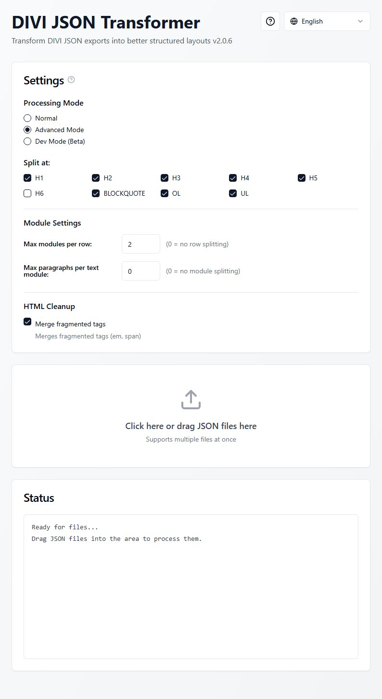

# DIVI JSON Transformer v2.0.7

https://github.com/MoebiusSt/divi-json-transformer

## ✨ Features

- **Split Content**: Automatically split large text modules at HTML elements (H1, H2, H3, H4, H5, H6, Blockquote, OL, UL)
- **Processing Modes**: 
  - **Normal Mode**: Basic splitting at headlines 
  - **Advanced Mode**: Additional control over module paragraph counts and also splits into new DIVI rows if needed.
- **Private Functions**: Experimental features for specific internal workflows (Footnotes, Interview Mode).
- **HTML Cleanup**: Merges fragmented tags (em, span) for cleaner code
- **Built-in Help**: Click the "?" button to view full documentation inside the app
- **Multi-Language Support**: Available in 8 languages
  - English 🇬🇧
  - Deutsch 🇩🇪
  - Français 🇫🇷
  - Español 🇪🇸
  - العربية 🇸🇦
  - Italiano 🇮🇹
  - Русский 🇷🇺
  - Nederlands 🇳🇱
- **Drag & Drop**: Simple file handling with drag & drop support
- **Multiple Files**: Process multiple JSON files at once
- **100% Local**: Everything runs in your browser - no server, no uploads, no data collection
- **No Installation**: Just open the HTML file in any modern browser, or put on any webserver. Or run from Claude.

## 🚀 How to Use

1. **Open the App**: Double-click `divi-json-transformer.html` in any modern web browser
2. **Read Documentation**: Click the "?" button in the top-right corner to view this documentation inside the app
3. **Configure Settings**: 
   - Choose processing mode (Normal or Advanced)
   - Select which HTML elements to split at
   - Enable/disable HTML cleanup step
   - (Advanced Mode) Set max modules per row and max paragraphs per module
4. **Add Files**: Either drag JSON files onto the drop zone or click to select files
5. **Download Results**: Transformed files are automatically downloaded as `*_output.json`

## 📋 Processing Modes

### Normal Mode
- Splits text at selected HTML elements
- Creates separate text modules for each section
- Simple and straightforward

### Advanced Mode
- All features of Normal Mode, plus:
- **Max Modules per Row**: Create new DIVI rows after X modules (0 = no row splitting)
- **Max Paragraphs per Module**: Split modules after X paragraphs (0 = no module splitting)
- Better control for complex layouts

### Private Functions (Experimental)
- Enable via checkbox to access:
- **Footnote Transformation**: Converts footnotes and indices in text into a linked footnote list.
- **Interview Mode**: Converts lists (OL, UL) into blockquotes (for specific interview layouts).
- **Extra Cleanup**: Remove empty spans, fix link icons.

### HTML Cleanup
- **Merge Fragmented Tags**: Combines consecutive `<em>` and `` tags with the same attributes

## 🌐 Supported Browsers

- Any modern browser with ES6+ support

## 🔒 Privacy & Security

- **100% Client-Side**: All processing happens in your browser
- **No Data Collection**: No analytics, tracking, or data transmission
- **No Server Required**: Works completely offline
- **No Installation**: No software or plugins needed

## 📦 What's Included

Single HTML file (`divi-json-transformer.html`) containing:
- Complete React application
- All UI components (shadcn/ui)
- Full transformation logic
- All translations
- Everything inlined - no external dependencies

## 💡 Use Cases

Perfect for:
- Breaking up long WordPress/DIVI articles into manageable sections
- Restructuring content for better mobile responsiveness
- Making content easier to edit in DIVI builder
- Improving content organization

## 🛠️ Technical Details

- Coded by Claude Sonnet 4.5 with 'app builder skill', Nov.2025 then taken over by Gemini3Pro
- Built with React 18 + TypeScript
- Styled with Tailwind CSS
- UI components from shadcn/ui
- Bundled with Parcel
- File size: 409KB (all-in-one with embedded documentation)

## 📝 Workflow Example

1. Export a page layout from DIVI as JSON
2. Open the transformer app
3. Drag the JSON file into the drop zone
4. Import the `*_output.json` back into DIVI

## 🆓 License

This tool is provided as-is, free to use for personal and commercial projects.

## 🤝 Sharing

Feel free to share this tool with anyone who works with DIVI! The single HTML file can be:
- Emailed
- Stored on USB drives
- Hosted on any web server
- Shared via cloud storage
- Used offline

---
**Version**: 2.0.7
**Last Updated**: January 2026  
**Compatibility**: DIVI Builder JSON exports
